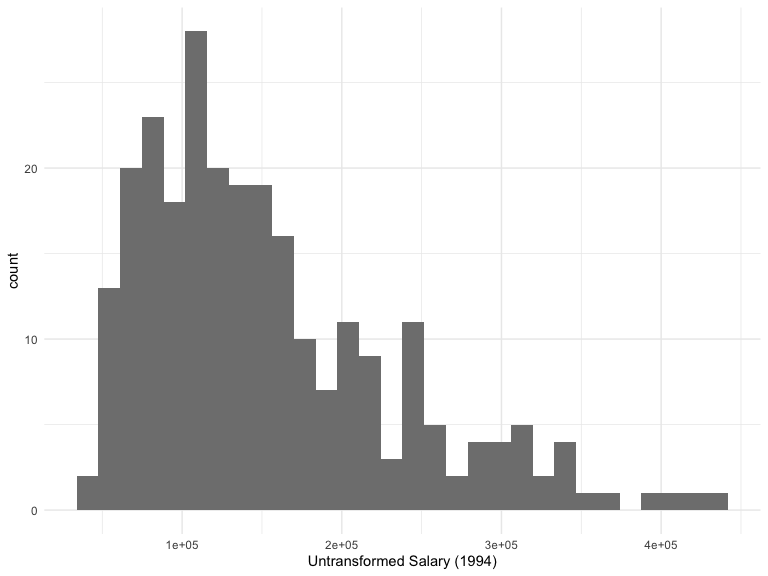
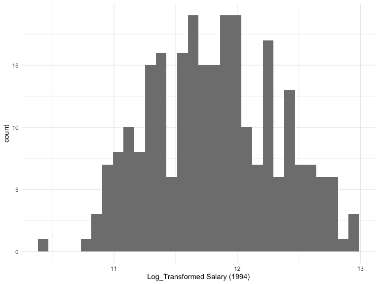
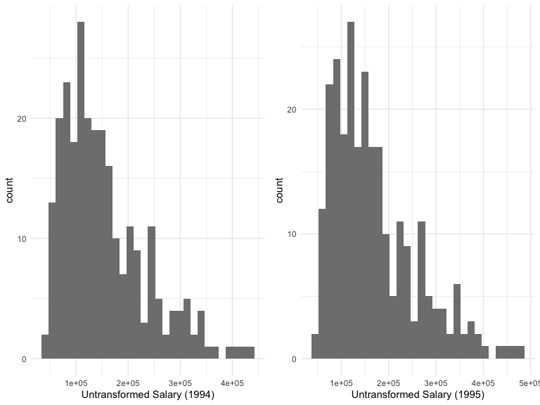
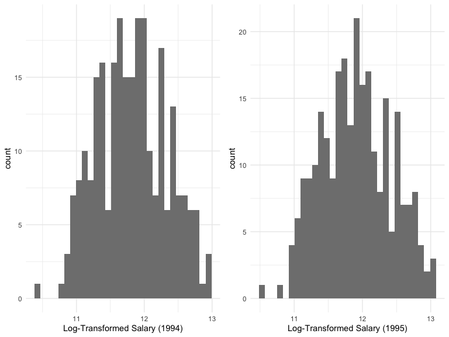
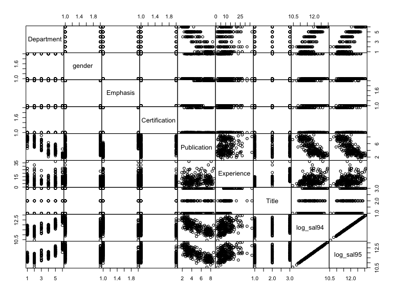
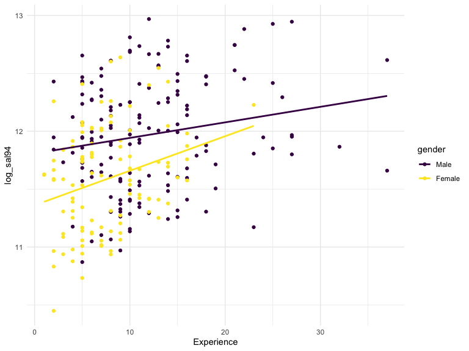
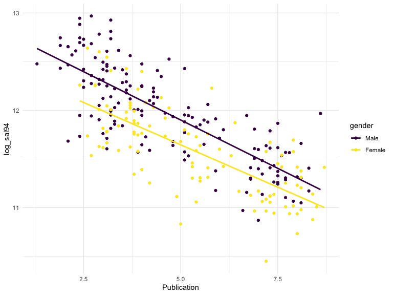

Final Project
================
Clement Mugenzi
12/6/2019

# Methods

## Data Description and Statistical Methods

  - Dept: Academic departments at Houston College of medicine.
    Biochemistry, Physiology, Genetics, Pediatrics, Medicine, and
    Surgery
  - Gender: A dichotomous variable coded with dummy variables ‘1’ for
    Male subjects and ‘0’ for Female subjects
  - Clin: A dummy variable with 1 = Primarily clinnical emphasis and 0 =
    Primarily research emphasis.
  - Cert: 1 = Board certified and 0 = not certified
  - Prate: Publication rate
  - Exper: years of experience since obtaining Medical Doctor degree.
  - Rank: 1 = Assistant professor, 2 = Associate professor, 3 = full
    professor
  - Sal94: Salary in academic year 1994
  - Sal05: Salary in academic year 1995.

The goal of this project is to investigate if claims made by a
university’s professor that there is gender discrimination when it comes
to salary are true by building different multiple regression models and
selecting the best and optimized model.

# Loading and cleaning the dataset

``` r
lawsuit_df =
  read_csv("Lawsuit.csv") %>% 
  janitor::clean_names() %>%
  dplyr::mutate(
    dept = factor(dept, levels = c("1", "2", "3",
                                   "4", "5", "6")),
    gender = factor(gender, levels = c("1", "0")),
    clin = factor(clin, levels = c("1", "0")),
    cert = factor(cert, levels = c("1", "0")),
    rank = factor(rank, levels = c("1", "2", "3"))) %>% 
  mutate(
    gender = recode(gender, "1" = "Male", "0" = "Female"),
    dept = recode(dept, "1" = "Biochemistry", "2" = "Physiology", "3" = "Genetics",
                  "4" = "Pediatrics", "5" = "Medicine", "6" = "Surgery"),
    clin = recode(clin, "1" = "clinical", "0" = "research"),
    cert = recode(cert, "1" = "certified", "0" = "Not certified"),
    rank = recode(rank, "1" = "assistant", "2" = "associate", "3" = "full")) %>%
  arrange(gender)
```

**Descriptive Statistics:**

``` r
# Cleaning output
tab1_controls = tableby.control(
               total = T,
               test = F,
               numeric.stats = c("meansd", "medianq1q3", "range"),
               cat.stats = "countpct",
               stats.labels = list(
               meansd = "Mean (SD)",
               medianq1q3 = "Median (Q1, Q3)",
               range = "Min - Max",
               countpct = "N (%)"))

tab1 = tableby(gender ~ dept + clin + cert + prate +
                  exper + rank + sal94 + sal95,
                data = lawsuit_df, control = tab1_controls)
summary(tab1, title = 'Descriptive Statistics', digits = 2, text = T)
```

|                    |           Male (N=155)           |         Female (N=106)          |          Total (N=261)          |
| :----------------- | :------------------------------: | :-----------------------------: | :-----------------------------: |
| dept               |                                  |                                 |                                 |
| \- Biochemistry    |            30 (19.4%)            |           20 (18.9%)            |           50 (19.2%)            |
| \- Physiology      |            20 (12.9%)            |           20 (18.9%)            |           40 (15.3%)            |
| \- Genetics        |            10 (6.5%)             |           11 (10.4%)            |            21 (8.0%)            |
| \- Pediatrics      |            10 (6.5%)             |           20 (18.9%)            |           30 (11.5%)            |
| \- Medicine        |            50 (32.3%)            |           30 (28.3%)            |           80 (30.7%)            |
| \- Surgery         |            35 (22.6%)            |            5 (4.7%)             |           40 (15.3%)            |
| clin               |                                  |                                 |                                 |
| \- clinical        |           100 (64.5%)            |           60 (56.6%)            |           160 (61.3%)           |
| \- research        |            55 (35.5%)            |           46 (43.4%)            |           101 (38.7%)           |
| cert               |                                  |                                 |                                 |
| \- certified       |           118 (76.1%)            |           70 (66.0%)            |           188 (72.0%)           |
| \- Not certified   |            37 (23.9%)            |           36 (34.0%)            |           73 (28.0%)            |
| prate              |                                  |                                 |                                 |
| \- Mean (SD)       |           4.65 (1.94)            |           5.35 (1.89)           |           4.93 (1.94)           |
| \- Median (Q1, Q3) |        4.00 (3.10, 6.70)         |        5.25 (3.73, 7.27)        |        4.40 (3.20, 6.90)        |
| \- Min - Max       |           1.30 - 8.60            |           2.40 - 8.70           |           1.30 - 8.70           |
| exper              |                                  |                                 |                                 |
| \- Mean (SD)       |           12.10 (6.70)           |           7.49 (4.17)           |          10.23 (6.23)           |
| \- Median (Q1, Q3) |       10.00 (7.00, 15.00)        |       7.00 (5.00, 10.00)        |       9.00 (6.00, 14.00)        |
| \- Min - Max       |           2.00 - 37.00           |          1.00 - 23.00           |          1.00 - 37.00           |
| rank               |                                  |                                 |                                 |
| \- assistant       |            43 (27.7%)            |           69 (65.1%)            |           112 (42.9%)           |
| \- associate       |            43 (27.7%)            |           21 (19.8%)            |           64 (24.5%)            |
| \- full            |            69 (44.5%)            |           16 (15.1%)            |           85 (32.6%)            |
| sal94              |                                  |                                 |                                 |
| \- Mean (SD)       |       177338.76 (85930.54)       |      118871.27 (56168.01)       |      153593.34 (80469.67)       |
| \- Median (Q1, Q3) | 155006.00 (109687.00, 231501.50) | 108457.00 (75774.50, 143096.00) | 133284.00 (90771.00, 200543.00) |
| \- Min - Max       |       52582.00 - 428876.00       |      34514.00 - 308081.00       |      34514.00 - 428876.00       |
| sal95              |                                  |                                 |                                 |
| \- Mean (SD)       |       194914.09 (94902.73)       |      130876.92 (62034.51)       |      168906.66 (88778.43)       |
| \- Median (Q1, Q3) | 170967.00 (119952.50, 257163.00) | 119135.00 (82345.25, 154170.50) | 148117.00 (99972.00, 218955.00) |
| \- Min - Max       |       58923.00 - 472589.00       |      38675.00 - 339664.00       |      38675.00 - 472589.00       |

Descriptive Statistics

**Exploring the distribution of the response variable:**

Let’s first look at the distribution of salaries in the year 1994:

``` r
lawsuit_df %>% 
  ggplot(aes(x = sal94)) + 
  geom_histogram(fill = "gray50") +
  labs(
    x = "Untransformed Salary (1994)")
```

    ## `stat_bin()` using `bins = 30`. Pick better value with `binwidth`.



The salary histogram in the year 1994 exhibits right skewness which
means I will try a different transformation.

**Log-Transformation of 1994 salary and its distribution:**

``` r
lawsuit_df = 
  lawsuit_df %>% 
  mutate(log_sal94 = log(sal94))

lawsuit_df %>% 
  ggplot(aes(x = log_sal94)) + 
  geom_histogram(fill = "gray50") +
  labs(
    x = "Log_Transformed Salary (1994)")
```

    ## `stat_bin()` using `bins = 30`. Pick better value with `binwidth`.



Second, let’s look at the distribution of salaries in the year 1995:

``` r
lawsuit_df %>% 
  ggplot(aes(x = sal95)) + 
  geom_histogram(fill = "gray50") +
  labs(
    x = "Untransformed Salary (1995)")
```

    ## `stat_bin()` using `bins = 30`. Pick better value with `binwidth`.



This histogram also seem to exhibit right skewness, therefore it is
worth transforming.

**Log-Transformation of 1994 salary and its distribution:**

``` r
lawsuit_df = 
  lawsuit_df %>% 
  mutate(log_sal95 = log(sal95))

lawsuit_df %>%
  ggplot(aes(x = log_sal95)) + 
  geom_histogram(fill = "gray50") +
  labs(
    x = "Log_Transformed Salary (1995)")
```

    ## `stat_bin()` using `bins = 30`. Pick better value with `binwidth`.



let’s try looking at scatter plot to identify linearity between
covariates and covariate-response relationships.

``` r
lawsuit_df %>% 
  select(-c(id, sal94, sal95)) %>% 
  pairs(gap = 0)
```



Based on the above scatterplot matrix, the use of the MLR is justified
due to the linear trend in the graphs of both salaries (1994 and 1995)
against department, Publication rates, years of experience. Let’s now
investigate the correlation of continuous predictors in the matrix
below.

``` r
lawsuit_df %>% 
  dplyr::select(prate, exper, log_sal94, log_sal95) %>% 
  cor() %>% kable()
```

|            |       prate |     exper |  log\_sal94 |  log\_sal95 |
| ---------- | ----------: | --------: | ----------: | ----------: |
| prate      |   1.0000000 | 0.1119603 | \-0.7667516 | \-0.7696988 |
| exper      |   0.1119603 | 1.0000000 |   0.3152043 |   0.3141280 |
| log\_sal94 | \-0.7667516 | 0.3152043 |   1.0000000 |   0.9993461 |
| log\_sal95 | \-0.7696988 | 0.3141280 |   0.9993461 |   1.0000000 |

The correlation matrix does not indicate strong correlation between
continuous variables except for the high correlation between both
salaries (1994 and 1995)

**Interaction terms in the model:**

``` r
mlr_int = lm(log_sal94 ~ rank * gender, data = lawsuit_df)
summary(mlr_int)
```

    ## 
    ## Call:
    ## lm(formula = log_sal94 ~ rank * gender, data = lawsuit_df)
    ## 
    ## Residuals:
    ##      Min       1Q   Median       3Q      Max 
    ## -1.05271 -0.37554  0.01028  0.34601  0.97298 
    ## 
    ## Coefficients:
    ##                            Estimate Std. Error t value Pr(>|t|)    
    ## (Intercept)                12.02235    0.07103 169.265  < 2e-16 ***
    ## rankassociate              -0.14468    0.10045  -1.440   0.1510    
    ## rankfull                   -0.02620    0.09049  -0.290   0.7724    
    ## genderFemale               -0.52052    0.09049  -5.752 2.52e-08 ***
    ## rankassociate:genderFemale  0.27194    0.15350   1.772   0.0777 .  
    ## rankfull:genderFemale       0.40560    0.15777   2.571   0.0107 *  
    ## ---
    ## Signif. codes:  0 '***' 0.001 '**' 0.01 '*' 0.05 '.' 0.1 ' ' 1
    ## 
    ## Residual standard error: 0.4658 on 255 degrees of freedom
    ## Multiple R-squared:  0.1764, Adjusted R-squared:  0.1602 
    ## F-statistic: 10.92 on 5 and 255 DF,  p-value: 1.551e-09

**Interactions: Graphical**

``` r
lawsuit_df %>% 
  ggplot(aes(x = exper, y = log_sal94, color = gender)) +
  geom_point() +
  geom_smooth(method = "lm", se = FALSE)
```



``` r
lawsuit_df %>% 
  ggplot(aes(x = prate, y = log_sal94, color = gender)) +
  geom_point() +
  geom_smooth(method = "lm", se = FALSE)
```



## Model Building

``` r
mlr_94 = lm(log_sal94 ~ dept + clin + cert +
                  exper + rank, data = lawsuit_df)
summary(mlr_94)
```

    ## 
    ## Call:
    ## lm(formula = log_sal94 ~ dept + clin + cert + exper + rank, data = lawsuit_df)
    ## 
    ## Residuals:
    ##      Min       1Q   Median       3Q      Max 
    ## -0.34794 -0.08101 -0.01879  0.08284  0.91563 
    ## 
    ## Coefficients:
    ##                    Estimate Std. Error t value Pr(>|t|)    
    ## (Intercept)       11.332458   0.034203 331.329  < 2e-16 ***
    ## deptPhysiology    -0.178202   0.029215  -6.100 4.02e-09 ***
    ## deptGenetics       0.185992   0.036644   5.076 7.55e-07 ***
    ## deptPediatrics     0.196076   0.035780   5.480 1.04e-07 ***
    ## deptMedicine       0.542815   0.029546  18.372  < 2e-16 ***
    ## deptSurgery        0.940948   0.035030  26.861  < 2e-16 ***
    ## clinresearch      -0.204889   0.021976  -9.323  < 2e-16 ***
    ## certNot certified -0.192846   0.021322  -9.045  < 2e-16 ***
    ## exper              0.018023   0.001802  10.000  < 2e-16 ***
    ## rankassociate      0.140061   0.023137   6.054 5.16e-09 ***
    ## rankfull           0.230151   0.025585   8.996  < 2e-16 ***
    ## ---
    ## Signif. codes:  0 '***' 0.001 '**' 0.01 '*' 0.05 '.' 0.1 ' ' 1
    ## 
    ## Residual standard error: 0.1342 on 250 degrees of freedom
    ## Multiple R-squared:  0.9329, Adjusted R-squared:  0.9302 
    ## F-statistic: 347.6 on 10 and 250 DF,  p-value: < 2.2e-16
