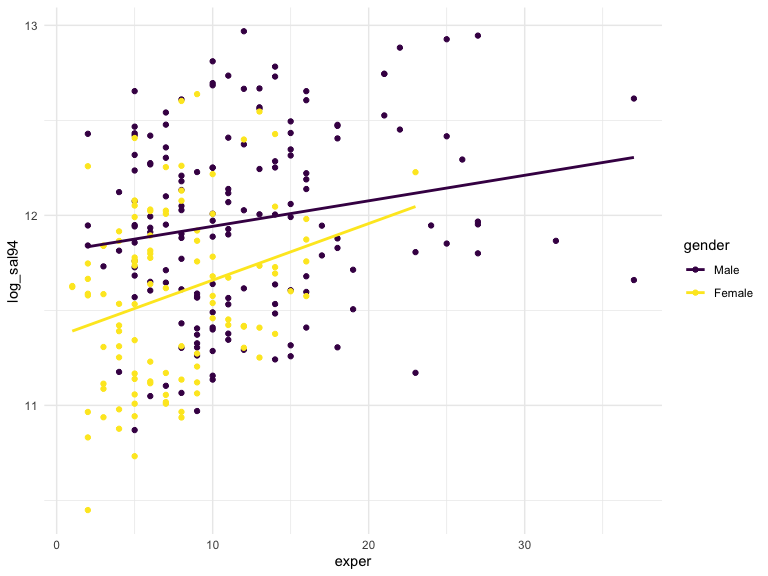
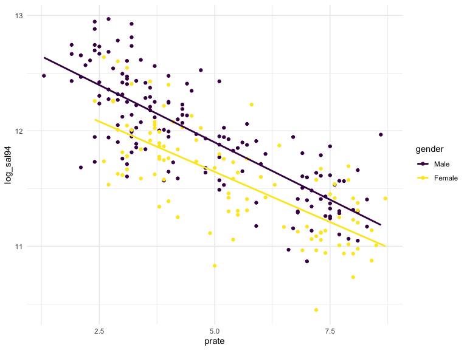

Association between gender and salary setting at the Houstong College of
Medicine
================
Clement Mugenzi, Zongchao Liu, Shuya Liu, Yuao Yang
12/6/2019

# Introduction

Title VII of the Civil Rights Act of 1964 is a federal law that
prohibits employers from discriminating against employees on the basis
of sex, race, color, national origin and religion (1). Also, the equal
pay act of 1963 requires that men and women in the same workplace be
given equal pay for equal work. Income inequality between men and women
who do the same work have been a point of debate over the years and
efforts have been made to ensure women receive the same remuneration as
men for doing equal work. While there have been several studies
conducted about the income gap between both genders, it is almost
impossible to find a single study that focuses on one profession or
industry.

The U.S education system is one area that is not immune to this income
gap problem. Several factors determines ones compansation in the
education system such as the area of expertise, years of experience,
title, the amount of research papers published, etc. Despite these
legitimate factors that determines compansation, there are many cases
that have been published claiming that female professors are getting
paid less compared to their male colleagues while bearing the same, if
not superior, titles or accolades.

The aim of this study is to examine the association between gender
discrimination in setting salary within the Houston college of medicine
where a female professor claimed, through a district court lawsuit, that
there was evidence of discrimination against women in giving promotions
and setting salaries. To do this, we will build multiple regression
models using seven predictor variables such as the department in which a
subject belongs to, their area of expertise, whether or not they are
board certified, their publication rate, years of experience, and their
position title. We will test for interactions and confounders that might
be present between all the stated predictors and our main predictor of
interest which is the subject’s gender. Our response variable of
interest will be both the baseline salary in year 1994 and the change in
salary between year 1994 and year 1995.

# Methods

## Data Description

  - Dept: Academic departments at Houston College of medicine.
    Biochemistry, Physiology, Genetics, Pediatrics, Medicine, and
    Surgery
  - Gender: A dichotomous variable coded with dummy variables ‘1’ for
    Male subjects and ‘0’ for Female subjects
  - Clin: A dummy variable with 1 = Primarily clinnical emphasis and 0 =
    Primarily research emphasis.
  - Cert: 1 = Board certified and 0 = not certified
  - Prate: Publication rate
  - Exper: years of experience since obtaining Medical Doctor degree.
  - Rank: 1 = Assistant professor, 2 = Associate professor, 3 = full
    professor
  - Sal94: Salary in academic year 1994.
  - Sal05: Salary in academic year 1995.

The *goal* of this project is to investigate if claims made by a Houston
university professor that there is gender discrimination when it comes
to salary are valid by building different multiple regression models
that best captures the association between gender and salary.

**Descriptive Statistics:**

Note that Values are weighted mean\(\pm\)SE for continuous variables or
weighted %\(\pm\)SE for categorical
variables.

|                                   |           Male (N=155)           |         Female (N=106)          |          Total (N=261)          |
| :-------------------------------- | :------------------------------: | :-----------------------------: | :-----------------------------: |
| dept                              |                                  |                                 |                                 |
| \- Biochemistry/Molecular Biology |            30 (19.4%)            |           20 (18.9%)            |           50 (19.2%)            |
| \- Physiology                     |            20 (12.9%)            |           20 (18.9%)            |           40 (15.3%)            |
| \- Genetics                       |            10 (6.5%)             |           11 (10.4%)            |            21 (8.0%)            |
| \- Pediatrics                     |            10 (6.5%)             |           20 (18.9%)            |           30 (11.5%)            |
| \- Medicine                       |            50 (32.3%)            |           30 (28.3%)            |           80 (30.7%)            |
| \- Surgery                        |            35 (22.6%)            |            5 (4.7%)             |           40 (15.3%)            |
| clin                              |                                  |                                 |                                 |
| \- Clinical Emphasis              |           100 (64.5%)            |           60 (56.6%)            |           160 (61.3%)           |
| \- Research Emphasis              |            55 (35.5%)            |           46 (43.4%)            |           101 (38.7%)           |
| cert                              |                                  |                                 |                                 |
| \- Board certified                |           118 (76.1%)            |           70 (66.0%)            |           188 (72.0%)           |
| \- Not certified                  |            37 (23.9%)            |           36 (34.0%)            |           73 (28.0%)            |
| prate                             |                                  |                                 |                                 |
| \- Mean (SD)                      |           4.65 (1.94)            |           5.35 (1.89)           |           4.93 (1.94)           |
| \- Median (Q1, Q3)                |        4.00 (3.10, 6.70)         |        5.25 (3.73, 7.27)        |        4.40 (3.20, 6.90)        |
| \- Min - Max                      |           1.30 - 8.60            |           2.40 - 8.70           |           1.30 - 8.70           |
| exper                             |                                  |                                 |                                 |
| \- Mean (SD)                      |           12.10 (6.70)           |           7.49 (4.17)           |          10.23 (6.23)           |
| \- Median (Q1, Q3)                |       10.00 (7.00, 15.00)        |       7.00 (5.00, 10.00)        |       9.00 (6.00, 14.00)        |
| \- Min - Max                      |           2.00 - 37.00           |          1.00 - 23.00           |          1.00 - 37.00           |
| rank                              |                                  |                                 |                                 |
| \- Assistant Professor            |            43 (27.7%)            |           69 (65.1%)            |           112 (42.9%)           |
| \- Associate Professor            |            43 (27.7%)            |           21 (19.8%)            |           64 (24.5%)            |
| \- Full Professor                 |            69 (44.5%)            |           16 (15.1%)            |           85 (32.6%)            |
| sal94                             |                                  |                                 |                                 |
| \- Mean (SD)                      |       177338.76 (85930.54)       |      118871.27 (56168.01)       |      153593.34 (80469.67)       |
| \- Median (Q1, Q3)                | 155006.00 (109687.00, 231501.50) | 108457.00 (75774.50, 143096.00) | 133284.00 (90771.00, 200543.00) |
| \- Min - Max                      |       52582.00 - 428876.00       |      34514.00 - 308081.00       |      34514.00 - 428876.00       |
| sal95                             |                                  |                                 |                                 |
| \- Mean (SD)                      |       194914.09 (94902.73)       |      130876.92 (62034.51)       |      168906.66 (88778.43)       |
| \- Median (Q1, Q3)                | 170967.00 (119952.50, 257163.00) | 119135.00 (82345.25, 154170.50) | 148117.00 (99972.00, 218955.00) |
| \- Min - Max                      |       58923.00 - 472589.00       |      38675.00 - 339664.00       |      38675.00 - 472589.00       |

Baseline Professional characteristics of the study population, according
to gender

**Exploring the distribution of the response variable:**

Let’s first look at the distribution of both salaries of year 1994 and
1995:


Both distributions exhibit right skewness which means they need to
undorgo a certain transformation.

**Log-Transformation of 1994 and 1995 salaries and their
distribution:**


let’s try looking at scatter plot to identify linearity between
covariates and covariate-response
relationships.


Based on the above scatterplot matrix, the use of the MLR is justified
due to the linear trend in the graphs of both salaries (1994 and 1995)
against department, Publication rates, years of experience. Let’s now
investigate the correlation of continuous predictors in the matrix
below.

|            |       prate |     exper |  log\_sal94 |  log\_sal95 |
| ---------- | ----------: | --------: | ----------: | ----------: |
| prate      |   1.0000000 | 0.1119603 | \-0.7667516 | \-0.7696988 |
| exper      |   0.1119603 | 1.0000000 |   0.3152043 |   0.3141280 |
| log\_sal94 | \-0.7667516 | 0.3152043 |   1.0000000 |   0.9993461 |
| log\_sal95 | \-0.7696988 | 0.3141280 |   0.9993461 |   1.0000000 |

The correlation matrix does not indicate strong correlation between
continuous variables except for the high correlation between both
salaries (1994 and 1995)

**Interactions: Graphical**

We will check possible interaction existing between the gender variable
and other predictor veriable since we are mainly interested in the
relationship between gender and the 1994 salary.

Let us include the interaction term in the model. The gender variable
was tested against the rest of the categorical variables (department,
clin, cert, prate, exper, and rank).

``` r
mlr_int = lm(log_sal94 ~ gender * rank, data = lawsuit_df)
summary(mlr_int)
```

    ## 
    ## Call:
    ## lm(formula = log_sal94 ~ gender * rank, data = lawsuit_df)
    ## 
    ## Residuals:
    ##      Min       1Q   Median       3Q      Max 
    ## -1.05271 -0.37554  0.01028  0.34601  0.97298 
    ## 
    ## Coefficients:
    ##                                      Estimate Std. Error t value Pr(>|t|)
    ## (Intercept)                          12.02235    0.07103 169.265  < 2e-16
    ## genderFemale                         -0.52052    0.09049  -5.752 2.52e-08
    ## rankAssociate Professor              -0.14468    0.10045  -1.440   0.1510
    ## rankFull Professor                   -0.02620    0.09049  -0.290   0.7724
    ## genderFemale:rankAssociate Professor  0.27194    0.15350   1.772   0.0777
    ## genderFemale:rankFull Professor       0.40560    0.15777   2.571   0.0107
    ##                                         
    ## (Intercept)                          ***
    ## genderFemale                         ***
    ## rankAssociate Professor                 
    ## rankFull Professor                      
    ## genderFemale:rankAssociate Professor .  
    ## genderFemale:rankFull Professor      *  
    ## ---
    ## Signif. codes:  0 '***' 0.001 '**' 0.01 '*' 0.05 '.' 0.1 ' ' 1
    ## 
    ## Residual standard error: 0.4658 on 255 degrees of freedom
    ## Multiple R-squared:  0.1764, Adjusted R-squared:  0.1602 
    ## F-statistic: 10.92 on 5 and 255 DF,  p-value: 1.551e-09

All but rank was found to be an effect modifier of the relationship
between gender and the 1994 salary. Specifically, we found that female
subjects with titles *“Full Professor”* were an effect modifier in the
relationship between gender and the 1994 salary.

using graphical representation, we examined the relationship between the
gender variable with both publication rate and years of experience and
found no interaction as seen in the parallel lines generated in both
graphs.



With a graphical display, it is evident that gender is not an effect
modifier in the relationship between years of experience and the 1994
salary.



Again with a graphical display, it is evident that gender is not an
effect modifier in the relationship between the rate of publishing
research papers and the 1994 salary.

## Statistical Methods

# Reference

**1.**
[Here](https://www.aauw.org/what-we-do/legal-resources/know-your-rights-at-work/title-vii/)
